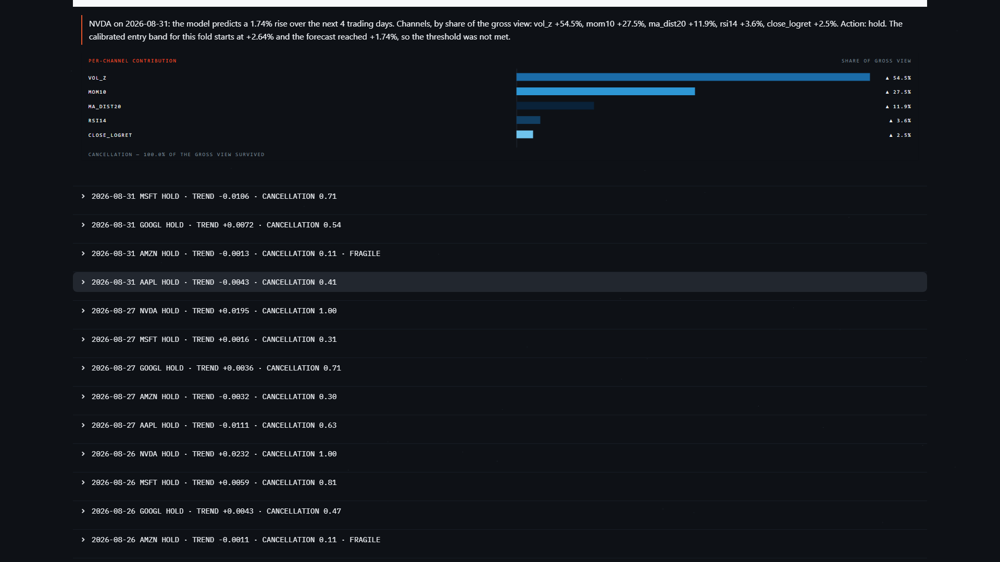
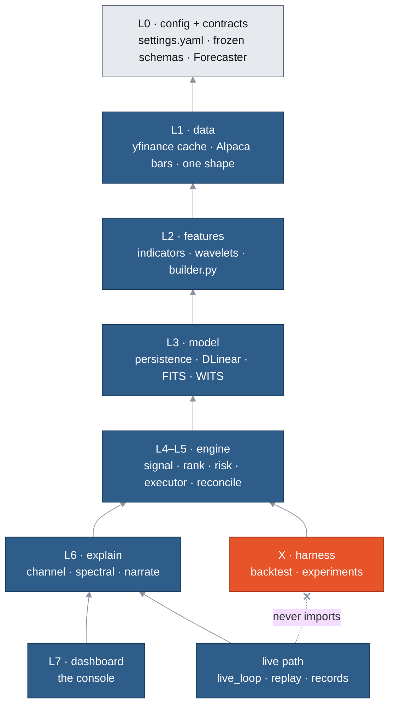

# GlassBox Trader

An explainable algorithmic trading system for US equities. It trades an Alpaca **paper**
account, and every decision it makes decomposes exactly into the inputs that produced it.

[](https://github.com/Bendavidian/glassbox-final-project/actions/workflows/ci.yml)


Final-year B.Sc. project in Computer Science, Bar-Ilan University, 2026.

---

## The result

> **These models extract nothing from this market that they do not also extract from white
> noise.**

The study tested three linear forecasters: DLinear and FITS, both from the published
literature, and WITS, a wavelet variant built for this study. It ran them over twenty US
large caps, sixteen walk-forward folds and a four-day horizon on daily closes. Two null
controls rebuilt the market's return series, one from Gaussian noise of matched variance
and one by shuffling. **When the real series was replaced with Gaussian noise, no model's
directional accuracy fell. Only buy-and-hold's did**, and buy-and-hold is the only arm
whose mechanism says it must. Its entire content is upward drift, and the noise control
removes drift.

| arm | direction, real | direction, white noise | noise − real |
|---|---|---|---|
| buy-and-hold (the control) | 0.5528 | 0.5011 | **−0.0517** (p_holm 0.0134) |
| DLinear | 0.4981 | 0.5156 | +0.0175 |
| FITS | 0.4948 | 0.5015 | +0.0067 |
| WITS | 0.4976 | 0.5001 | +0.0025 |

*Anchor 0, averaged over sixteen folds. Source: [`docs/GB57_RESULTS.md`](docs/GB57_RESULTS.md)
§57.2–57.3, from `results.csv`. The Holm correction on the control row is over these four
arms only.*

This is a finding, not a failure. A null result and a disconnected pipeline produce the same
table. The buy-and-hold row is what tells them apart: the instrument detects an effect where
one is known to exist, and detects none in the models.

**The system does not beat buy-and-hold, and that is the same finding.** Over the 938
trading days in `report/daily_equity.csv`, buy-and-hold compounds to +125.19% and DLinear to
+45.51%. The market's structure is real: an always-long rule beats a coin flip by about five
points. It is not reachable by explicit or implicit frequency decomposition at this horizon.
That claim is narrower than market efficiency, and it is the one this study supports.

Of 117 paired Wilcoxon tests, Holm-corrected in one pass, 29 survive at α = 0.05, and **every
one has the model worse than its reference.**

---



*1 September 2026, five-symbol universe.*

---

## What it does

- Keeps a fixed universe of twenty US large caps, selected by a rule written before the
  names were chosen ([spec §2.4](docs/GLASSBOX_PROJECT_SPEC.md)).
- Builds five causal feature channels from daily bars (close log-return, RSI-14, volatility
  z-score, 10-bar momentum, distance from a 20-bar mean), plus three optional causal wavelet
  bands.
- Forecasts the next four days' log-return path with one of four linear models behind a
  frozen `Forecaster` protocol: persistence, DLinear, FITS and WITS.
- Turns the forecast into `enter_long`, `hold` or `exit` against a threshold calibrated per
  fold on validation data only, then ranks, sizes and applies risk limits.
- Places orders on Alpaca's paper API in Co-Pilot mode: exits and protection run on their
  own, and every new entry waits for a human to approve it.
- Explains every decision exactly, per input channel (and per frequency bin under FITS), in
  English or Hebrew.
- Runs the same code offline as a walk-forward study, as a replay of a recorded fold, and
  live once per completed daily bar.
- Shows all of it on a Streamlit console that reads files and computes nothing itself.

---

## Architecture

Data flows strictly upward: no layer imports from a layer above it. Two
[import-linter](https://github.com/seddonym/import-linter) contracts in `pyproject.toml`
enforce this. CI runs them, and so does `tests/contracts/test_layers.py`. The validation
harness sits *above* the live path, so nothing on the live path can import it.



Arrows point from a layer to what it may import. The live-path layers are blue and the
offline harness is orange. The dashed edge is the second import contract: `live_loop`,
`replay` and `records` may never import `backtest` or `experiments`.

| layer | package | owns | must not | lines |
|---|---|---|---|---|
| L0 | `config/`, `contracts/` | `settings.yaml`, typed config, frozen schemas | contain logic | 1,433 |
| L1 | `data/` | fetching, caching, quality checks, UTC normalisation | compute features | 748 |
| L2 | `features/` | indicators, wavelets, **window assembly** | know which model consumes it | 873 |
| L3 | `model/` | fit, predict, expose weights | know about orders, money or brokers | 2,270 |
| L4–L5 | `engine/` | signal, rank, size, risk; orders and reconciliation | decision code talks to no broker; execution code makes no decision | 1,730 |
| L6 | `explain/` | exact attributions and prose | alter a decision | 1,002 |
| L7 | `dashboard/` | render state | compute anything | 4,308 |
| X | `backtest/`, `experiments/` | walk-forward, backtest, metrics, the study grid | touch the live broker | 3,215 |
| — | `live_loop.py`, `replay.py`, `records.py`, `live_lock.py`, `smoke_offline.py` | entry points and the live record | — | 4,292 |

*Responsibilities from [spec §3.2](docs/GLASSBOX_PROJECT_SPEC.md). Line counts from
[`docs/ARCHITECTURE_INVENTORY.md`](docs/ARCHITECTURE_INVENTORY.md) §B.7 (22,450 lines in
total). The full design is in [`docs/GB55_ARCHITECTURE.md`](docs/GB55_ARCHITECTURE.md).*

`features/builder.py` is the only place a model input window is assembled. Training, the
live loop and the replay all call it. That rests on a standing ruling rather than an import
contract, and the parity sweep below is what would catch a second builder.

---

## Key features

### Unusual ones

| feature | where | what makes it non-obvious |
|---|---|---|
| **Exact attribution** | `explain/channel.py`, `contracts/schemas.py` | The per-channel contributions sum to the forecast within `EXACTNESS_TOLERANCE = 1e-5`; the worst case measured was 5.005e-08 over 1,000 windows (`DECISIONS.md`). It is the model's own arithmetic rearranged, not an estimate. DLinear drops the intercept and uses per-channel weights so this holds. A test forbids SHAP, LIME and captum in `explain/`. |
| **Causality harness** | `tests/causality.py` | Perturbs every bar after a split point, by scaling and by shuffling, at three split points. Asserts nothing before the split moves. Applied to every feature channel, with tests that the harness itself rejects deliberate leaks. Its blind spots (calendar rules, cross-sectional features) are documented in GB56 §56.3. |
| **Parity sweep** | `tests/features/test_train_live_parity.py`, `tests/sweep.py` | Training and live windows must be **byte-identical**, not close: 25 timestamps × 20 symbols = 500 comparisons at a derived 445-bar history floor. At an earlier 352-bar floor only 32 of 125 pairs matched. `SweepResult` refuses to be used as a boolean, and a one-cell sweep is refused. |
| **Bit-identical determinism** | `tests/experiments/test_study.py` | Re-running the grid gives the same bytes on the same machine. Seeds, thread counts and BLAS threads are pinned, and inference is pure numpy. Cross-architecture reproducibility is untested and not claimed. |
| **Guards that test rules, not functions** | `tests/test_scaffold.py`, `tests/config/test_config.py`, `tests/backtest/test_metrics.py`, `tests/test_phase2_ledger.py` | The spec's module tree must match the package in both directions. The universe written in the spec must match `settings.yaml`. Every declared dependency must be pinned in the lockfile. MAE may never appear without flatness beside it. Only the config layer may read the environment. |

### The live system

| feature | where | what makes it non-obvious |
|---|---|---|
| **Co-Pilot gate** | `engine/executor.py` | Exits, reconciliation and protection are autonomous; a new entry becomes a pending approval, not an order. A fully autonomous mode exists in config and is not deployed. |
| **The broker is the truth** | `engine/reconcile.py`, `live_loop.py` | Each cycle reconciles against Alpaca. A position with no decision behind it is quarantined. If it turns out to be the loop's own late fill, it is adopted under the decision that produced it. Both paths first ran unattended on 23 September 2026 (GB55 §55.9). |
| **Protection before entry** | `live_loop.py` | Ten steps per cycle. Stops are verified and re-armed at step 4, before any entry at step 8. A second consecutive arming failure closes the position at market. |
| **Once per completed bar** | `live_loop.py` | The bar in progress is dropped. Each symbol is decided once per completed bar, and later cycles skip it. |
| **One loop per state directory** | `live_lock.py` | A second launch is refused with exit code 3. |
| **Paper only** | `config/loader.py` | `require_paper_endpoint` refuses any non-paper URL before a connection opens. |

### The console

| feature | where | what makes it non-obvious |
|---|---|---|
| **Three colour roles** | `dashboard/tokens.py` | Orange is chrome and never a value, blue encodes data, and green/red mean gain/loss only. A test enumerates every chart builder, and every status colour must also carry a sign and a glyph. |
| **Source pills** | `dashboard/app.py` | Every panel names its source (`LIVE`, `BACKTEST`, `REPLAY`), the artefact and its fold range. |
| **References, not absolutes** | `dashboard/app.py` | Reliability leads the page as a delta against the always-long bar. |

---

## Results

Every result is a delta against its own reference: MAE against persistence, direction against
always-long, Sharpe and total return against buy-and-hold. There is no composite score.

**Direction does not depend on where the folds are cut.** On real data, at three fold-grid
anchors:

| arm | anchor 0 | anchor 21 | anchor 42 |
|---|---|---|---|
| DLinear | 0.4981 | 0.5021 | 0.5044 |
| FITS | 0.4948 | 0.4909 | 0.4934 |
| WITS | 0.4976 | 0.4958 | 0.4976 |
| always-long | 0.5530 | 0.5479 | 0.5565 |


*`report/direction_by_arm.png`, generated by `glassbox/experiments/report.py` from
`results.csv` (twenty-symbol grid).*

**MAE measures flatness.** Across the six arms, MAE and flatness rank identically (Spearman
+1.000; `report/report.md`). Persistence forecasts zero and has the lowest error, so every
surviving MAE result, 22 of the 29, says only that a model forecasts larger moves than zero.

| arm | mean MAE | mean flatness |
|---|---|---|
| persistence C0 | 0.0128 | 0.000 |
| persistence C2 | 0.0128 | 0.000 |
| WITS | 0.0130 | 0.157 |
| FITS | 0.0131 | 0.188 |
| DLinear C0 | 0.0134 | 0.249 |
| DLinear C2 | 0.0136 | 0.295 |


*`report/cof_sweep.png`, same source. FITS scores at or above its real-data accuracy on white
noise at every cutoff tested.*

Four further results, each in the chapter:

- **Most of FITS is grid geometry.** Its learned gain response correlates with the same
  architecture trained on white noise at r² = 0.957 (twenty symbols). WITS, which swaps the
  Fourier transform for a wavelet transform in the same position, is less grid-determined:
  paired p = 0.0042, lower in 13 of 16 folds. See §57.5.
- **The textbook exit cannot be built at this venue.** Alpaca refuses bracket and OCO orders
  on fractional quantities, and a working sell order holds the whole position. That leaves
  one protective stop, and it must be a DAY order. The backtest models both constructions on
  its `target_in_loop` axis. The buildable one trades 5–7% less and is not measurably worse.
  See §57.6.
- **The risk cap binds.** At twenty symbols the 50% gross-exposure cap binds in 13 of 16
  folds, in 534 of 963 sizing calls. See §57.7 and `report/gross_exposure.csv`.
- **Five symbols were underpowered.** The move from five symbols to twenty took Holm
  survivors from 17 to 29. Effect sizes were the same or smaller in 23 of 29 cells; the
  paired-difference spread fell. See §57.8.

Limitations, stated rather than defended: survivorship is built into the universe rule, the
null controls exist at one fold-grid anchor only, and the sixteen folds end at a snapshot
of 2026-08-13 and appear to contain no severe market dislocation (§57.9).

**Full chapter: [`docs/GB57_RESULTS.md`](docs/GB57_RESULTS.md).** The methodology behind it:
[`docs/GB56_METHODOLOGY.md`](docs/GB56_METHODOLOGY.md).

---

## Known limitations at submission

Defects in the live system as submitted. Each was checked against the submitted code before
it was written here, and each was left unfixed under the submission code freeze. Line
numbers refer to the submitted code.

1. **The model's exit recommendations never reach the approval queue, so its exit rule does
   not execute.** In Co-Pilot mode, the configured mode (`glassbox/config/settings.yaml:81`),
   `exit_position` returns a `pending_approval` submission and writes nothing
   (`glassbox/live_loop.py:1978-1987`). The only `records.save_pending` call is on the entry
   path (`live_loop.py:1185`), so the console has nothing to approve, and the exit is
   recommended again on every cycle and never sent: on 5 October 2026, the model's exit for
   V on every completed cycle. The loop-side take-profit goes
   through the same function (`live_loop.py:1699`) and would be stranded the same way.
   *Consequence:* in Co-Pilot mode a position leaves only by its broker-side stop, by rule
   3's flatten after repeated arming failures, or by hand. Found in GB-67. Unfixed under the
   code freeze.
2. **A stop exit never becomes a trade record (T1).** Step 2 builds trades only from filled
   sells not yet in `state.seen_orders` (`live_loop.py:918-924`), and every order the cycle
   reads is added to that set whatever its status (`live_loop.py:953`). A stop is read as
   working on the cycle after it is armed, so when it later fills it is no longer fresh and
   `records.emit_trades` never sees it. It is recorded only if it fills before any cycle of
   the same process has read it as working, or across a restart, because `seen_orders` lives
   in memory (`live_loop.py:433`). *Consequence:* `trades.jsonl` and the live metrics that
   read it describe a subset of realised P&L, and the subset leaves out the exit that bounds
   losses, so the record errs in the flattering direction. Pinned by the strict xfail
   `test_a_stop_seen_working_and_then_filled_becomes_one_trade`
   (`tests/test_live_loop.py:2822`). Unfixed under the code freeze.
3. **Reconciliation still expects two protective orders per position (T2).** `reconcile`
   counts every live sell and reports `missing_protection` below two
   (`glassbox/engine/reconcile.py:271-274`, `:288`; the message at `:283` and the module
   docstring at `:31-35` say the same), but since 26 August 2026 the policy is one stop.
   Every correctly protected position is therefore reported. On 5 October 2026 step 3
   logged five `missing_protection` warnings per cycle, one per held position, each with
   `broker=1`: one correct stop per position. Step 4 rightly ignores them: `protect_book`
   works out what is missing from `LEGS` against the live orders (`live_loop.py:1850`) and
   never reads reconcile's output. The tests that pin the two-order premise, a state Alpaca
   refuses, belong to the same fix (`tests/engine/test_reconcile.py:38-39`, `:249`, `:273`).
   *Consequence:* the warning fires on every cycle for every held position, so a genuinely
   missing stop cannot be told apart in the log; on 30 September 2026, 6 of 1,639 were
   genuine. Unfixed under the code freeze.
4. **The session summary's exit lines say less than they appear to (T3).** `broker=` is an
   order count on `missing_protection` (`reconcile.py:281`) and a share quantity on every
   other kind (`:207`, `:226`, `:242`). `open orders at exit` (`live_loop.py:338`) lists DAY
   stops read after the close, while the broker is expiring them, so they protect nothing
   overnight. `positions at exit` is `sorted(state.book.managed)` (`live_loop.py:2242`), the
   book as of the last reconcile rather than a broker read at exit. *Consequence:* the
   summary can read as protection that is about to lapse, and it can list as held a position
   that a fill closed after the last cycle. Unfixed under the code freeze.
5. **An entry that has not filled when protection is attached gets no stop from that call.**
   `executor.protect` returns without arming when the filled quantity is zero
   (`glassbox/engine/executor.py:525-530`), and leaves the stop to the cycle that sees the
   fill. The loop's own entry path polls briefly for the fill first
   (`live_loop.py:2024-2031`); an approval from the console, through `executor.approve`
   (`live_loop.py:1758`), does not. *Consequence:* a filled position can be without a stop
   until the loop's next cycle adopts it and arms one: up to one `live.poll_seconds` (60 s)
   while the loop is running, and, for an order approved after the close, from the fill at
   the next open until the loop's first cycle of that session. Unfixed under the code freeze.
6. **Stops are DAY orders, so protection lapses at every close.** Alpaca accepts only DAY
   orders on a fractional quantity (`executor.py:31`), so the stop is submitted with
   `TimeInForce.DAY` (`executor.py:604`) and expires at the close. A position held overnight
   has no stop from the close until the first cycle of the next session re-arms it
   (`live_loop.py:1861-1864`); the session banner says so (`live_loop.py:705-706`).
   *Consequence:* narrower than "no stop overnight". The stop is a fixed price, so a gap
   through it overnight leaves the re-armed stop marketable at the open, which is what the
   backtest's `stop_gap` rule models (`executor.py:33-41`). What diverges is the time
   between the open and the first arming, and any session in which the arming does not
   happen: on 2 October 2026 a crash in step 2 kept step 4 from running all session, and
   five positions went unprotected (fixed in GB-29). Unfixed under the code freeze.

---

## Quickstart

Python **3.12 or newer**. No GPU is needed. Credentials are needed only for the live loop.

### 1. Install

```powershell
git clone https://github.com/Bendavidian/glassbox-final-project.git
cd glassbox-final-project
python -m venv .venv
.\.venv\Scripts\Activate.ps1          # Git Bash: source .venv/Scripts/activate · macOS/Linux: source .venv/bin/activate
.\scripts\setup.ps1
```

`setup.ps1` installs `requirements.lock`, installs the package editable with `--no-deps`, and
then checks that `import glassbox` resolves to this checkout. On another shell, run:

```bash
python -m pip install -r requirements.lock
python -m pip install -e ".[dev]" --no-deps
```

Install from the lockfile, not `pyproject.toml`. The lockfile pins the versions every
reported number was produced with, and CI installs the same set.

### 2. The offline path: no network, no credentials

The twenty-symbol data snapshot is committed in `data_cache/`, so this runs from a clean
clone.

```powershell
python -m glassbox.smoke_offline                          # data → features → train → calibrate → backtest, beside persistence
python -m glassbox.smoke_offline --folds 16 --model fits  # more folds, another arm
```

The full study, then the report generated from its output:

```powershell
python -m glassbox.experiments.study --plan-only    # cell count and time estimate, runs nothing
python -m glassbox.experiments.study                # writes results.csv and report/daily_equity.csv
python -m glassbox.experiments.report               # writes report/report.md and the two figures
```

The grid is single-threaded by design, for bit-identical output. Its last full run took
100 minutes 56 seconds (GB57 §57.8).

### 3. Replay a fold and open the console, still offline

```powershell
python -m glassbox.smoke_offline --prepare-replay 13 checkpoints/replay
python -m glassbox.replay --state-dir checkpoints/replay
streamlit run glassbox/dashboard/app.py -- --state-dir checkpoints/replay --source replay:fold-13
```

The replay drives the live loop's own cycle over one fold's test range, with no broker and
no feed. The console's arguments go after `--`, because only the config layer may read the
environment.

### 4. The live loop: Alpaca paper only

```powershell
copy .env.example .env                    # then fill in a PAPER key from app.alpaca.markets
python scripts/smoke_alpaca.py            # prints account status; exits non-zero on a non-paper endpoint
python -m glassbox.smoke_offline --prepare-live checkpoints/live
python -m glassbox.live_loop --sessions 3
streamlit run glassbox/dashboard/app.py -- --state-dir checkpoints/live --source live
```

`checkpoints/` is not tracked, so `--prepare-live` must run once before the loop. Pass
`--sessions N` to keep one process across N exchange sessions. The default is one, which
stops at the first close. A dry run must use its own copy of the state directory:

```powershell
Copy-Item -Recurse checkpoints/live $env:TEMP/dryrun_state
python -m glassbox.live_loop --dry-run --state-dir $env:TEMP/dryrun_state --max-cycles 12
```

<details>
<summary>Troubleshooting</summary>

| symptom | cause |
|---|---|
| `ModuleNotFoundError` for `pytest`, `pandas` or `yfinance` | The virtual environment is not active. `python -c "import sys; print(sys.executable)"` must print a path inside `.venv`. |
| `import glassbox` works but something else fails | Python finds `glassbox/` from the repository root even without the install. Run `setup.ps1`, which verifies the editable install. |
| PowerShell refuses `Activate.ps1` | `Set-ExecutionPolicy -Scope Process -ExecutionPolicy Bypass`, for that terminal only. |
| `pytest` collects nothing and exits 5 | You are not in the repository root; `pyproject.toml` holds the test configuration. |
| Clone reports success but files are missing, or `python -m venv` fails at `ensurepip` | Windows `MAX_PATH`. The longest tracked path is 66 characters, so keep the clone root under 193. `git config core.longpaths true` fixes git only; Python needs `LongPathsEnabled` or a shallower root. Simplest: clone near the drive root. |
| `unauthorized` from `smoke_alpaca.py` | `.env` still holds placeholders, or the key is from a live account rather than a paper one. |
| `smoke_alpaca.py` exits 2 without output | `ALPACA_BASE_URL` is not the paper endpoint. This is a refusal, not a bug. |
| `live_loop` exits 3 | Another loop holds that state directory. Stop it, or use a different `--state-dir`. |
| A test fails naming a credential-shaped string | A secret has reached a tracked file. Rotate the key first, then remove it. |

</details>

---

## Project structure

```
glassbox/                 the package: seven layers plus the harness (see Architecture)
  config/settings.yaml    every runtime value in the system
  live_loop.py            the live decision loop, ten steps per cycle
  replay.py               a recorded fold, driven through the live loop's cycle, offline
  smoke_offline.py        the one-command offline path and the prepare commands
tests/                    mirrors the package; causality.py, sweep.py and fake_broker.py are shared harnesses
docs/                     the specification, the report chapters, the deck, Hebrew study guides
report/                   generated study output: report.md, figures, CSVs, console screenshots
figures/                  the GB-46 frequency-response figure
scripts/                  setup, Alpaca connectivity, probes and one-off measurements
data_cache/               the committed twenty-symbol parquet snapshot
results.csv               the study grid's output, one row per condition, arm and fold
reference/                a third-party project kept for study; read-only, never imported
prompts/                  the Claude Code session prompts, one file per sprint
requirements.lock         the exact dependency set CI installs
.github/workflows/ci.yml  lint, format check and the full test suite, on Windows
```

At the root: `CLAUDE.md` (the working rules), `PROGRESS.md` (what was built, by task),
`DECISIONS.md` (why), `IDEAS_PARKED.md` (what was deliberately not built),
`SOLO_BUILD_PLAN.md` (build order), `GLASSBOX_PHASE2_EXPANSION.md` (post-GATE 2 scope).
`checkpoints/` and `logs/` are written by runs and are not tracked.

---

## Testing

```powershell
pytest                  # the suite, bare: no path, no -k, no marker
ruff check .
black --check .
lint-imports            # the two layer contracts
```

**1,598 tests collected**: 1,593 passed and 5 xfailed at the last full run (commit `677e4a9`,
5 October 2026). That is 60
files, with 26,281 lines of test against 22,450 lines of package. These
are collected tests, not a pass count. The authority on whether they pass is the CI badge
above. The suite needs no credentials and no network. CI runs bare `pytest` on
Windows against the locked dependency set.

A test runs against whatever the tree holds now. A number in this README is a record of one
run, so check CI rather than trusting the number.

Beyond the usual unit tests, several guards test the project's own rules:

- **Leak-freedom:** every feature is asserted causal, and the harness is tested against
  planted leaks. No timestamp may appear in two splits of one fold.
- **Exactness:** every registered forecaster must be exact. The check iterates the registry,
  so a new model cannot skip it. A contract test runs every model through the same
  properties, with meta-tests that it fails a broken one.
- **Two copies of one fact:** spec against package tree, spec universe against config,
  `pyproject.toml` against the lockfile, the model registry against the CLI choices.
- **Reporting honesty:** MAE never without flatness; every delta names its reference; every
  claim is shown at all three anchors and against both null controls.
- **Secrets:** no tracked file may contain a credential-shaped string, `.env` must stay
  untracked, and the scanner is tested against real key shapes.
- **Determinism:** the same grid twice gives the same numbers.

The full list is in [`docs/ARCHITECTURE_INVENTORY.md`](docs/ARCHITECTURE_INVENTORY.md) §B.12.

---

## External components and disclosure

Everything external is listed with its version, its use and a file citation in
[`docs/ARCHITECTURE_INVENTORY.md`](docs/ARCHITECTURE_INVENTORY.md).

**Dependencies.** Thirteen runtime packages: pandas, numpy, pyyaml, torch, yfinance,
alpaca-py, PyWavelets, scipy, streamlit, pandas-market-calendars, python-dotenv, pyarrow and
matplotlib. Six for development: pytest, hypothesis, import-linter, ruff, black, and
playwright, which drives the console headless for the screenshot captures. Each runtime
package has a dated entry in `DECISIONS.md` recording why it was added.
`requirements.lock` pins 99 distributions. Torch is imported only inside training; all
inference is numpy.

**The reference project.** `reference/algotrading_project-main/` is an existing
LTSF-Linear trading project, kept read-only for study. It is excluded from packaging,
linting and test collection, and sits outside the import contract's root package.
[`reference/REFERENCE_AUDIT.md`](reference/REFERENCE_AUDIT.md), written before the code,
records what could be taken and what was refused.

- **Taken:** the DLinear decomposition blocks, six return and risk formulas, the backtest
  event-loop structure and enums, `EarlyStopping` and `adjust_learning_rate`.
- **Refused:** its metrics module (one Sharpe function returns a hardcoded `12`; one variant
  overwrites the prediction with ground truth) and its strategy module (all four stop and
  target comparisons inverted). Both were rewritten, and the four comparisons are each
  tested.

**The models, and their true lineage.**

| model | lineage |
|---|---|
| **DLinear** | LTSF-Linear (Zeng et al., AAAI 2023). The trend/remainder decomposition is **adapted from the reference implementation**; that code traces back through LTSF-Linear to Autoformer. The linear heads are **reimplemented**, with four recorded departures: per-channel weights, no intercept, zero initialisation, and one summed output. |
| **FITS** | FITS (Xu, Zeng & Xu, ICLR 2024, arXiv:2307.03756). **Written from the paper's description.** No FITS source code exists in this repository. |
| **WITS** | **Original to this project.** It puts a wavelet transform where FITS puts an FFT, to test whether FITS's grid-dependence is specific to Fourier. The prediction was written down before the model was. |
| persistence | The zero-change baseline. |

**External services.** yfinance for historical bars. Alpaca's data API (SIP feed, no
fallback) for live bars. Alpaca's trading API, paper endpoint only, enforced before any call.
The GitHub REST API from a development script only.

**AI-assisted development.** This project was built with Claude Code, and that is recorded
in the repository rather than stated here:

- 161 of 163 commits (as of `f4ace6e`) carry a `Co-Authored-By: Claude` trailer. The two
  without are the documents that bootstrapped the project.
- [`CLAUDE.md`](CLAUDE.md) is the operating contract every session read.
- `prompts/` holds the actual session prompts, 1,572 lines across four sprint files.
- `DECISIONS.md` records where the assistant was wrong and was corrected by the authors or
  by measurement.

The explanation layer uses no perturbation-attribution library, and a test asserts it.

---

## Documentation

| document | what it holds |
|---|---|
| [`docs/GLASSBOX_PROJECT_SPEC.md`](docs/GLASSBOX_PROJECT_SPEC.md) | The specification: architecture, frozen contracts, methodology, gate criteria |
| [`GLASSBOX_PHASE2_EXPANSION.md`](GLASSBOX_PHASE2_EXPANSION.md) | Scope after GATE 2: the twenty-symbol universe, WITS, the schedule |
| [`docs/GB55_ARCHITECTURE.md`](docs/GB55_ARCHITECTURE.md) | Report chapter: architecture and system design |
| [`docs/GB56_METHODOLOGY.md`](docs/GB56_METHODOLOGY.md) | Report chapter: leak freedom, the robustness checks, statistics |
| [`docs/GB57_RESULTS.md`](docs/GB57_RESULTS.md) | Report chapter: results, discussion, future work (the submitted version) |
| [`docs/GB57_OUTLINE.md`](docs/GB57_OUTLINE.md) | The outline GB57 was written against |
| [`docs/GB57_RESULTS_AND_DISCUSSION.md`](docs/GB57_RESULTS_AND_DISCUSSION.md) | Superseded five-symbol draft, kept for its argument, not its numbers |
| [`docs/SUBMISSION_DOC_CORRECTIONS.md`](docs/SUBMISSION_DOC_CORRECTIONS.md) | Claims later measurement contradicted, with the corrected figures |
| [`docs/ARCHITECTURE_INVENTORY.md`](docs/ARCHITECTURE_INVENTORY.md) | Every external component and every module, cited to file and line |
| [`docs/ARCHITECTURE_DECK.md`](docs/ARCHITECTURE_DECK.md) | The architecture and disclosure deck |
| [`docs/GB58_DECK.md`](docs/GB58_DECK.md) | The presentation deck and speaker notes |
| [`docs/GB54_VIDEO_SCRIPT.md`](docs/GB54_VIDEO_SCRIPT.md) | The three-minute video script |
| [`docs/he/`](docs/he/) | Hebrew study guides for the chapters and decks |
| [`report/report.md`](report/report.md) | The generated study report, regenerated from `results.csv` |
| [`report/screenshots/CAPTIONS.md`](report/screenshots/CAPTIONS.md) | What each console capture shows and the conditions it was taken under |
| [`ARCHITECTURE.md`](ARCHITECTURE.md) | How the package is put together, for a developer |
| [`PROGRESS.md`](PROGRESS.md) · [`DECISIONS.md`](DECISIONS.md) | What was built, task by task, and why each decision was taken |

---

## Authors

Ben Davidian · Noy Shani

Academic coursework. Not investment advice, and never connected to a live brokerage account.
