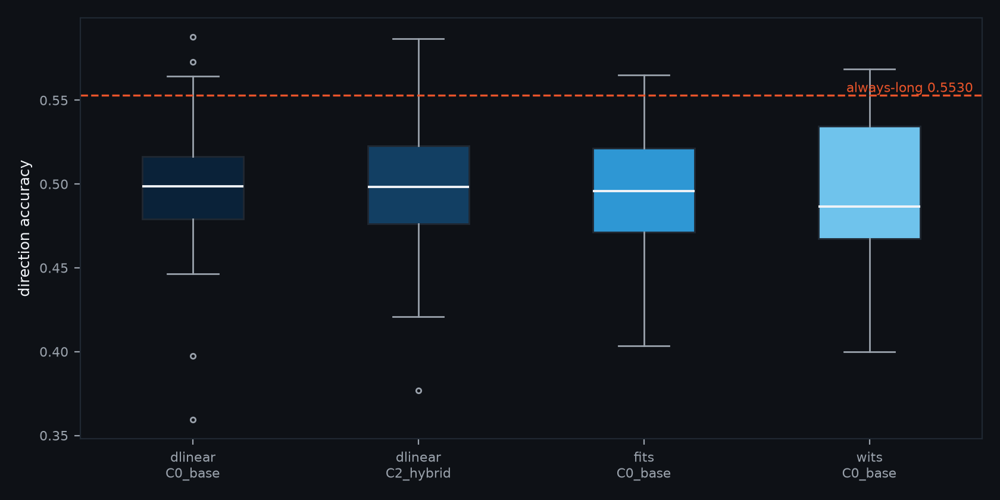
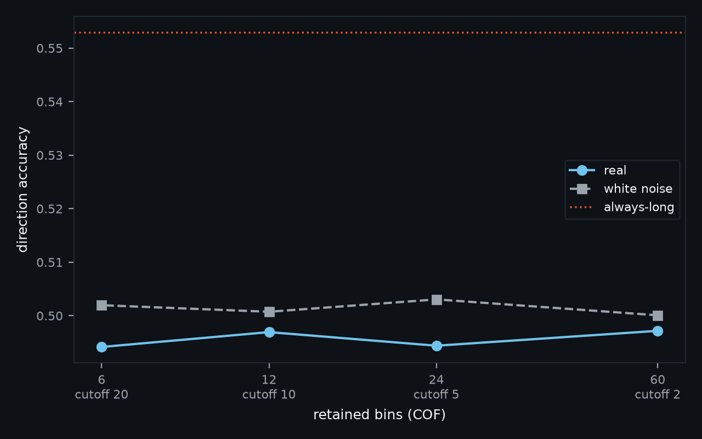

# GlassBox Trader — study results

**Data snapshot: last bar 2026-08-13**
1110 rows, 768 reportable (342 null-control or skipped) · 16 folds · anchors [0, 21, 42] · learning rates [1e-05, 0.0001, 0.001] · cutoffs [2, 5, 10, 20]

## Summary

Every metric is a delta against **its own** reference (`mae` → persistence, `direction` → always_long, `sharpe` → buy_and_hold, `total_return` → buy_and_hold).

| anchor | arm | n_folds | n_trades | direction | direction_reference | direction_delta | direction_p | direction_p_holm | mae | flatness | mae_reference | mae_delta | mae_p | mae_p_holm | sharpe | sharpe_reference | sharpe_delta | sharpe_p | sharpe_p_holm | total_return | total_return_reference | total_return_delta | total_return_p | total_return_p_holm |
|---|---|---|---|---|---|---|---|---|---|---|---|---|---|---|---|---|---|---|---|---|---|---|---|---|
| 0 | dlinear · C0_base | 16 | 35.75 | 0.4973 | always_long |  |  |  | 0.0135 | 0.3278 | persistence |  |  |  | 1.3072 | buy_and_hold |  |  |  | 0.02 | buy_and_hold |  |  |  |
| 0 | dlinear · C2_hybrid | 16 | 33.4375 | 0.4996 | always_long |  |  |  | 0.0138 | 0.3867 | persistence |  |  |  | 0.2847 | buy_and_hold |  |  |  | 0.0057 | buy_and_hold |  |  |  |
| 0 | fits · C0_base | 16 | 36.6562 | 0.4944 | always_long |  |  |  | 0.0131 | 0.1895 | persistence |  |  |  | 0.7087 | buy_and_hold |  |  |  | 0.0121 | buy_and_hold |  |  |  |
| 0 | persistence · C0_base | 16 | 0.0 |  | always_long |  |  |  | 0.0128 | 0.0 | persistence |  |  |  |  | buy_and_hold |  |  |  | 0.0 | buy_and_hold |  |  |  |
| 0 | persistence · C2_hybrid | 16 | 0.0 |  | always_long |  |  |  | 0.0128 | 0.0 | persistence |  |  |  |  | buy_and_hold |  |  |  | 0.0 | buy_and_hold |  |  |  |
| 0 | wits · C0_base | 16 | 30.8438 | 0.4966 | always_long |  |  |  | 0.013 | 0.1638 | persistence |  |  |  | 0.7125 | buy_and_hold |  |  |  | 0.0136 | buy_and_hold |  |  |  |
| 21 | dlinear · C0_base | 16 | 31.25 | 0.5021 | always_long |  |  |  | 0.0136 | 0.3341 | persistence |  |  |  | 0.9581 | buy_and_hold |  |  |  | 0.0109 | buy_and_hold |  |  |  |
| 21 | dlinear · C2_hybrid | 16 | 30.1875 | 0.4969 | always_long |  |  |  | 0.0139 | 0.3923 | persistence |  |  |  | 1.0084 | buy_and_hold |  |  |  | 0.0138 | buy_and_hold |  |  |  |
| 21 | fits · C0_base | 16 | 31.5625 | 0.4909 | always_long |  |  |  | 0.0131 | 0.1857 | persistence |  |  |  | 0.7424 | buy_and_hold |  |  |  | 0.0103 | buy_and_hold |  |  |  |
| 21 | persistence · C0_base | 16 | 0.0 |  | always_long |  |  |  | 0.0128 | 0.0 | persistence |  |  |  |  | buy_and_hold |  |  |  | 0.0 | buy_and_hold |  |  |  |
| 21 | persistence · C2_hybrid | 16 | 0.0 |  | always_long |  |  |  | 0.0128 | 0.0 | persistence |  |  |  |  | buy_and_hold |  |  |  | 0.0 | buy_and_hold |  |  |  |
| 21 | wits · C0_base | 16 | 25.5 | 0.4958 | always_long |  |  |  | 0.013 | 0.1602 | persistence |  |  |  | 0.5348 | buy_and_hold |  |  |  | 0.0106 | buy_and_hold |  |  |  |
| 42 | dlinear · C0_base | 16 | 37.6875 | 0.5044 | always_long |  |  |  | 0.0138 | 0.3352 | persistence |  |  |  | 1.7727 | buy_and_hold |  |  |  | 0.0192 | buy_and_hold |  |  |  |
| 42 | dlinear · C2_hybrid | 16 | 43.5 | 0.5062 | always_long |  |  |  | 0.0141 | 0.4002 | persistence |  |  |  | 0.5086 | buy_and_hold |  |  |  | 0.0046 | buy_and_hold |  |  |  |
| 42 | fits · C0_base | 16 | 34.8125 | 0.4934 | always_long |  |  |  | 0.0133 | 0.1875 | persistence |  |  |  | 1.2018 | buy_and_hold |  |  |  | 0.0195 | buy_and_hold |  |  |  |
| 42 | persistence · C0_base | 16 | 0.0 |  | always_long |  |  |  | 0.013 | 0.0 | persistence |  |  |  |  | buy_and_hold |  |  |  | 0.0 | buy_and_hold |  |  |  |
| 42 | persistence · C2_hybrid | 16 | 0.0 |  | always_long |  |  |  | 0.013 | 0.0 | persistence |  |  |  |  | buy_and_hold |  |  |  | 0.0 | buy_and_hold |  |  |  |
| 42 | wits · C0_base | 16 | 30.1875 | 0.4976 | always_long |  |  |  | 0.0132 | 0.1592 | persistence |  |  |  | 0.6082 | buy_and_hold |  |  |  | 0.0112 | buy_and_hold |  |  |  |

**Spearman(MAE, flatness) = +1.000 across the 6 arms** (+0.072 pooled over the 624 individual arm-folds), against **Spearman(MAE, direction) = +0.600 across arms** (-0.160 pooled). §7.3's claim is the **arm-level** one — a results table compares whole arms — and that is the figure this report uses. At that level, MAE against flatness is close to a monotone increasing function; MAE against directional accuracy is moderately related. So the MAE column is a flatness column unless `flatness` is beside it, which is why it always is.

## Every claim, at every anchor and against both nulls

### No arm beats the always-long bar (DLinear C0)

*points vs always-long*

| anchor | real | shuffled | noise |
|---|---|---|---|
| 0 | -5.5713 | -3.1201 | 1.4513 |
| 21 | -4.5772 |  |  |
| 42 | -5.2059 |  |  |

### No arm beats the always-long bar (FITS C0)

*points vs always-long*

| anchor | real | shuffled | noise |
|---|---|---|---|
| 0 | -5.858 | -3.3946 | 0.1915 |
| 21 | -5.7017 |  |  |
| 42 | -6.3111 |  |  |

### Does FITS beat DLinear on direction?

*points*

| anchor | real | shuffled | noise |
|---|---|---|---|
| 0 | -0.2867 | -0.2746 | -1.2598 |
| 21 | -1.1246 |  |  |
| 42 | -1.1051 |  |  |

### Do the wavelets help DLinear?

*points*

| anchor | real | shuffled | noise |
|---|---|---|---|
| 0 | 0.2373 | -0.1359 | -1.1433 |
| 21 | -0.5242 |  |  |
| 42 | 0.1735 |  |  |

## The COF sweep

| cutoff_period_days | cof | dead_row_fraction | n_folds | direction | direction_reference | edge_points | mae | flatness | sharpe | total_return | noise_direction | real_minus_noise_points |
|---|---|---|---|---|---|---|---|---|---|---|---|---|
| 2 | 60 | 0.0167 | 16 | 0.4972 | 0.553 | -5.5798 | 0.0134 | 0.2931 | 0.354 | 0.0069 | 0.5001 | -0.2905 |
| 5 | 24 | 0.0417 | 16 | 0.4944 | 0.553 | -5.858 | 0.0131 | 0.1895 | 0.7087 | 0.0121 | 0.503 | -0.8653 |
| 10 | 12 | 0.0833 | 16 | 0.4969 | 0.553 | -5.6039 | 0.013 | 0.1577 | 0.1942 | 0.0047 | 0.5007 | -0.3803 |
| 20 | 6 | 0.1667 | 16 | 0.4942 | 0.553 | -5.8815 | 0.0129 | 0.1308 | 0.7707 | 0.0089 | 0.502 | -0.7805 |

## Paired Wilcoxon signed-rank

**117 tests in the family**, and the family is every test in this table. `p` is uncorrected and `p_holm` is Holm-Bonferroni over all of them, controlling the family-wise error rate. The exact two-sided test on 16 folds cannot return a p below **3.05e-05**, so no claim here can be significant past that however large its effect.

| anchor | lr | control | target_in_loop | cutoff_period_days | model | channels | metric | reference | n_folds | mean | sd | reference_mean | mean_delta | statistic | p | p_holm | n_tests |
|---|---|---|---|---|---|---|---|---|---|---|---|---|---|---|---|---|---|
| 0 | 0.001 | real | True | 5 | persistence | C0_base | total_return | buy_and_hold | 16 | 0.0 | 0.0 | 0.0537 | -0.0537 | 15.0 | 0.0042 | 0.2592 | 117 |
| 0 | 0.001 | real | True | 5 | persistence | C2_hybrid | total_return | buy_and_hold | 16 | 0.0 | 0.0 | 0.0537 | -0.0537 | 15.0 | 0.0042 | 0.2592 | 117 |
| 0 | 0.001 | real | True | 5 | dlinear | C0_base | mae | persistence | 16 | 0.0135 | 0.0019 | 0.0128 | 0.0008 | 0.0 | 0.0 | 0.0036 | 117 |
| 0 | 0.001 | real | True | 5 | dlinear | C0_base | direction | always_long | 16 | 0.4973 | 0.0252 | 0.553 | -0.0557 | 9.0 | 0.001 | 0.0856 | 117 |
| 0 | 0.001 | real | True | 5 | dlinear | C0_base | sharpe | buy_and_hold | 15 | 1.7413 | 1.804 | 2.0455 | -0.3042 | 41.0 | 0.3028 | 1.0 | 117 |
| 0 | 0.001 | real | True | 5 | dlinear | C0_base | total_return | buy_and_hold | 16 | 0.024 | 0.0253 | 0.0537 | -0.0297 | 20.0 | 0.011 | 0.4065 | 117 |
| 0 | 0.001 | real | True | 5 | dlinear | C2_hybrid | mae | persistence | 16 | 0.0138 | 0.0019 | 0.0128 | 0.0011 | 0.0 | 0.0 | 0.0036 | 117 |
| 0 | 0.001 | real | True | 5 | dlinear | C2_hybrid | direction | always_long | 16 | 0.4996 | 0.0279 | 0.553 | -0.0533 | 9.0 | 0.001 | 0.0856 | 117 |
| 0 | 0.001 | real | True | 5 | dlinear | C2_hybrid | sharpe | buy_and_hold | 14 | 0.4851 | 2.3621 | 1.9684 | -1.4834 | 15.0 | 0.0166 | 0.4065 | 117 |
| 0 | 0.001 | real | True | 5 | dlinear | C2_hybrid | total_return | buy_and_hold | 16 | 0.0069 | 0.0318 | 0.0537 | -0.0468 | 14.0 | 0.0034 | 0.2182 | 117 |
| 0 | 0.001 | real | True | 5 | fits | C0_base | mae | persistence | 16 | 0.0131 | 0.002 | 0.0128 | 0.0003 | 0.0 | 0.0 | 0.0036 | 117 |
| 0 | 0.001 | real | True | 5 | fits | C0_base | direction | always_long | 16 | 0.4944 | 0.0363 | 0.553 | -0.0586 | 19.0 | 0.0092 | 0.3674 | 117 |
| 0 | 0.001 | real | True | 5 | fits | C0_base | sharpe | buy_and_hold | 14 | 0.9241 | 2.2042 | 1.9984 | -1.0743 | 20.0 | 0.0419 | 0.5862 | 117 |
| 0 | 0.001 | real | True | 5 | fits | C0_base | total_return | buy_and_hold | 16 | 0.0159 | 0.0332 | 0.0537 | -0.0378 | 23.0 | 0.0182 | 0.4065 | 117 |
| 0 | 0.001 | real | True | 5 | wits | C0_base | mae | persistence | 16 | 0.013 | 0.0019 | 0.0128 | 0.0002 | 0.0 | 0.0 | 0.0036 | 117 |
| 0 | 0.001 | real | True | 5 | wits | C0_base | direction | always_long | 16 | 0.4966 | 0.0421 | 0.553 | -0.0563 | 21.0 | 0.0131 | 0.4065 | 117 |
| 0 | 0.001 | real | True | 5 | wits | C0_base | sharpe | buy_and_hold | 15 | 0.6423 | 2.0221 | 2.0455 | -1.4032 | 10.0 | 0.0026 | 0.189 | 117 |
| 0 | 0.001 | real | True | 5 | wits | C0_base | total_return | buy_and_hold | 16 | 0.0123 | 0.0341 | 0.0537 | -0.0413 | 15.0 | 0.0042 | 0.2592 | 117 |
| 21 | 0.001 | real | True | 5 | persistence | C0_base | total_return | buy_and_hold | 16 | 0.0 | 0.0 | 0.0477 | -0.0477 | 21.0 | 0.0131 | 0.4065 | 117 |
| 21 | 0.001 | real | True | 5 | persistence | C2_hybrid | total_return | buy_and_hold | 16 | 0.0 | 0.0 | 0.0477 | -0.0477 | 21.0 | 0.0131 | 0.4065 | 117 |
| 21 | 0.001 | real | True | 5 | dlinear | C0_base | mae | persistence | 16 | 0.0136 | 0.0023 | 0.0128 | 0.0008 | 0.0 | 0.0 | 0.0036 | 117 |
| 21 | 0.001 | real | True | 5 | dlinear | C0_base | direction | always_long | 16 | 0.5021 | 0.0303 | 0.5479 | -0.0458 | 9.0 | 0.001 | 0.0856 | 117 |
| 21 | 0.001 | real | True | 5 | dlinear | C0_base | sharpe | buy_and_hold | 15 | 0.9581 | 3.0831 | 1.7318 | -0.7736 | 31.0 | 0.107 | 0.963 | 117 |
| 21 | 0.001 | real | True | 5 | dlinear | C0_base | total_return | buy_and_hold | 16 | 0.0109 | 0.0401 | 0.0477 | -0.0369 | 18.0 | 0.0076 | 0.351 | 117 |
| 21 | 0.001 | real | True | 5 | dlinear | C2_hybrid | mae | persistence | 16 | 0.0139 | 0.0024 | 0.0128 | 0.0011 | 0.0 | 0.0 | 0.0036 | 117 |
| 21 | 0.001 | real | True | 5 | dlinear | C2_hybrid | direction | always_long | 16 | 0.4969 | 0.0339 | 0.5479 | -0.051 | 9.0 | 0.001 | 0.0856 | 117 |
| 21 | 0.001 | real | True | 5 | dlinear | C2_hybrid | sharpe | buy_and_hold | 14 | 1.0084 | 2.3219 | 1.7587 | -0.7503 | 34.0 | 0.2676 | 1.0 | 117 |
| 21 | 0.001 | real | True | 5 | dlinear | C2_hybrid | total_return | buy_and_hold | 16 | 0.0138 | 0.0341 | 0.0477 | -0.0339 | 24.0 | 0.0214 | 0.4279 | 117 |
| 21 | 0.001 | real | True | 5 | fits | C0_base | mae | persistence | 16 | 0.0131 | 0.0024 | 0.0128 | 0.0003 | 0.0 | 0.0 | 0.0036 | 117 |
| 21 | 0.001 | real | True | 5 | fits | C0_base | direction | always_long | 16 | 0.4909 | 0.0338 | 0.5479 | -0.057 | 10.0 | 0.0013 | 0.1037 | 117 |
| 21 | 0.001 | real | True | 5 | fits | C0_base | sharpe | buy_and_hold | 14 | 0.7424 | 2.8926 | 1.9876 | -1.2452 | 16.0 | 0.0203 | 0.4255 | 117 |
| 21 | 0.001 | real | True | 5 | fits | C0_base | total_return | buy_and_hold | 16 | 0.0103 | 0.0441 | 0.0477 | -0.0374 | 12.0 | 0.0021 | 0.1602 | 117 |
| 21 | 0.001 | real | True | 5 | wits | C0_base | mae | persistence | 16 | 0.013 | 0.0024 | 0.0128 | 0.0002 | 6.0 | 0.0004 | 0.038 | 117 |
| 21 | 0.001 | real | True | 5 | wits | C0_base | direction | always_long | 16 | 0.4958 | 0.0362 | 0.5479 | -0.0521 | 13.0 | 0.0027 | 0.189 | 117 |
| 21 | 0.001 | real | True | 5 | wits | C0_base | sharpe | buy_and_hold | 13 | 0.5348 | 2.6632 | 1.6829 | -1.1481 | 18.0 | 0.0574 | 0.7458 | 117 |
| 21 | 0.001 | real | True | 5 | wits | C0_base | total_return | buy_and_hold | 16 | 0.0106 | 0.0369 | 0.0477 | -0.0372 | 20.0 | 0.011 | 0.4065 | 117 |
| 42 | 0.001 | real | True | 5 | persistence | C0_base | total_return | buy_and_hold | 16 | 0.0 | 0.0 | 0.055 | -0.055 | 5.0 | 0.0003 | 0.0278 | 117 |
| 42 | 0.001 | real | True | 5 | persistence | C2_hybrid | total_return | buy_and_hold | 16 | 0.0 | 0.0 | 0.055 | -0.055 | 5.0 | 0.0003 | 0.0278 | 117 |
| 42 | 0.001 | real | True | 5 | dlinear | C0_base | mae | persistence | 16 | 0.0138 | 0.0024 | 0.013 | 0.0008 | 0.0 | 0.0 | 0.0036 | 117 |
| 42 | 0.001 | real | True | 5 | dlinear | C0_base | direction | always_long | 16 | 0.5044 | 0.0287 | 0.5565 | -0.0521 | 0.0 | 0.0 | 0.0036 | 117 |
| 42 | 0.001 | real | True | 5 | dlinear | C0_base | sharpe | buy_and_hold | 16 | 1.7727 | 2.1644 | 2.0222 | -0.2495 | 54.0 | 0.4954 | 1.0 | 117 |
| 42 | 0.001 | real | True | 5 | dlinear | C0_base | total_return | buy_and_hold | 16 | 0.0192 | 0.0261 | 0.055 | -0.0358 | 13.0 | 0.0027 | 0.189 | 117 |
| 42 | 0.001 | real | True | 5 | dlinear | C2_hybrid | mae | persistence | 16 | 0.0141 | 0.0024 | 0.013 | 0.0011 | 0.0 | 0.0 | 0.0036 | 117 |
| 42 | 0.001 | real | True | 5 | dlinear | C2_hybrid | direction | always_long | 16 | 0.5062 | 0.0273 | 0.5565 | -0.0503 | 7.0 | 0.0006 | 0.051 | 117 |
| 42 | 0.001 | real | True | 5 | dlinear | C2_hybrid | sharpe | buy_and_hold | 15 | 0.5086 | 1.8754 | 1.7649 | -1.2563 | 18.0 | 0.0151 | 0.4065 | 117 |
| 42 | 0.001 | real | True | 5 | dlinear | C2_hybrid | total_return | buy_and_hold | 16 | 0.0046 | 0.0265 | 0.055 | -0.0503 | 10.0 | 0.0013 | 0.1037 | 117 |
| 42 | 0.001 | real | True | 5 | fits | C0_base | mae | persistence | 16 | 0.0133 | 0.0024 | 0.013 | 0.0003 | 0.0 | 0.0 | 0.0036 | 117 |
| 42 | 0.001 | real | True | 5 | fits | C0_base | direction | always_long | 16 | 0.4934 | 0.0263 | 0.5565 | -0.0631 | 1.0 | 0.0001 | 0.0058 | 117 |
| 42 | 0.001 | real | True | 5 | fits | C0_base | sharpe | buy_and_hold | 16 | 1.2018 | 2.0782 | 2.0222 | -0.8204 | 27.0 | 0.0335 | 0.5031 | 117 |
| 42 | 0.001 | real | True | 5 | fits | C0_base | total_return | buy_and_hold | 16 | 0.0195 | 0.0354 | 0.055 | -0.0354 | 3.0 | 0.0002 | 0.014 | 117 |
| 42 | 0.001 | real | True | 5 | wits | C0_base | mae | persistence | 16 | 0.0132 | 0.0024 | 0.013 | 0.0002 | 0.0 | 0.0 | 0.0036 | 117 |
| 42 | 0.001 | real | True | 5 | wits | C0_base | direction | always_long | 16 | 0.4976 | 0.0324 | 0.5565 | -0.0589 | 0.0 | 0.0 | 0.0036 | 117 |
| 42 | 0.001 | real | True | 5 | wits | C0_base | sharpe | buy_and_hold | 15 | 0.6082 | 1.8449 | 2.1482 | -1.54 | 10.0 | 0.0026 | 0.189 | 117 |
| 42 | 0.001 | real | True | 5 | wits | C0_base | total_return | buy_and_hold | 16 | 0.0112 | 0.0293 | 0.055 | -0.0438 | 1.0 | 0.0001 | 0.0058 | 117 |
| 0 | 0.0001 | real | True | 5 | persistence | C0_base | total_return | buy_and_hold | 16 | 0.0 | 0.0 | 0.0537 | -0.0537 | 15.0 | 0.0042 | 0.2592 | 117 |
| 0 | 0.0001 | real | True | 5 | persistence | C2_hybrid | total_return | buy_and_hold | 16 | 0.0 | 0.0 | 0.0537 | -0.0537 | 15.0 | 0.0042 | 0.2592 | 117 |
| 0 | 0.0001 | real | True | 5 | dlinear | C0_base | mae | persistence | 16 | 0.0129 | 0.0019 | 0.0128 | 0.0001 | 1.0 | 0.0001 | 0.0058 | 117 |
| 0 | 0.0001 | real | True | 5 | dlinear | C0_base | direction | always_long | 16 | 0.4964 | 0.0425 | 0.553 | -0.0566 | 7.0 | 0.0006 | 0.051 | 117 |
| 0 | 0.0001 | real | True | 5 | dlinear | C0_base | sharpe | buy_and_hold | 14 | 0.8644 | 1.6913 | 1.9684 | -1.104 | 24.0 | 0.0785 | 0.7849 | 117 |
| 0 | 0.0001 | real | True | 5 | dlinear | C0_base | total_return | buy_and_hold | 16 | 0.0091 | 0.0223 | 0.0537 | -0.0445 | 15.0 | 0.0042 | 0.2592 | 117 |
| 0 | 0.0001 | real | True | 5 | dlinear | C2_hybrid | mae | persistence | 16 | 0.013 | 0.0019 | 0.0128 | 0.0002 | 0.0 | 0.0 | 0.0036 | 117 |
| 0 | 0.0001 | real | True | 5 | dlinear | C2_hybrid | direction | always_long | 16 | 0.4929 | 0.0387 | 0.553 | -0.0601 | 7.0 | 0.0006 | 0.051 | 117 |
| 0 | 0.0001 | real | True | 5 | dlinear | C2_hybrid | sharpe | buy_and_hold | 14 | 1.1949 | 2.1891 | 1.9984 | -0.8035 | 27.0 | 0.1189 | 0.963 | 117 |
| 0 | 0.0001 | real | True | 5 | dlinear | C2_hybrid | total_return | buy_and_hold | 16 | 0.0135 | 0.0363 | 0.0537 | -0.0402 | 18.0 | 0.0076 | 0.351 | 117 |
| 0 | 0.0001 | real | True | 5 | fits | C0_base | mae | persistence | 16 | 0.0131 | 0.002 | 0.0128 | 0.0003 | 0.0 | 0.0 | 0.0036 | 117 |
| 0 | 0.0001 | real | True | 5 | fits | C0_base | direction | always_long | 16 | 0.4928 | 0.0406 | 0.553 | -0.0602 | 20.0 | 0.011 | 0.4065 | 117 |
| 0 | 0.0001 | real | True | 5 | fits | C0_base | sharpe | buy_and_hold | 14 | -0.1703 | 2.2682 | 1.8898 | -2.0601 | 8.0 | 0.0031 | 0.2014 | 117 |
| 0 | 0.0001 | real | True | 5 | fits | C0_base | total_return | buy_and_hold | 16 | 0.0021 | 0.0356 | 0.0537 | -0.0516 | 14.0 | 0.0034 | 0.2182 | 117 |
| 0 | 0.0001 | real | True | 5 | wits | C0_base | mae | persistence | 16 | 0.013 | 0.0019 | 0.0128 | 0.0002 | 0.0 | 0.0 | 0.0036 | 117 |
| 0 | 0.0001 | real | True | 5 | wits | C0_base | direction | always_long | 16 | 0.4996 | 0.0427 | 0.553 | -0.0533 | 22.0 | 0.0155 | 0.4065 | 117 |
| 0 | 0.0001 | real | True | 5 | wits | C0_base | sharpe | buy_and_hold | 16 | 0.3899 | 2.3309 | 1.86 | -1.4702 | 24.0 | 0.0214 | 0.4279 | 117 |
| 0 | 0.0001 | real | True | 5 | wits | C0_base | total_return | buy_and_hold | 16 | 0.0082 | 0.038 | 0.0537 | -0.0454 | 16.0 | 0.0052 | 0.263 | 117 |
| 0 | 0.0 | real | True | 5 | persistence | C0_base | total_return | buy_and_hold | 16 | 0.0 | 0.0 | 0.0537 | -0.0537 | 15.0 | 0.0042 | 0.2592 | 117 |
| 0 | 0.0 | real | True | 5 | persistence | C2_hybrid | total_return | buy_and_hold | 16 | 0.0 | 0.0 | 0.0537 | -0.0537 | 15.0 | 0.0042 | 0.2592 | 117 |
| 0 | 0.0 | real | True | 5 | dlinear | C0_base | mae | persistence | 16 | 0.0128 | 0.0019 | 0.0128 | 0.0 | 59.0 | 0.6685 | 1.0 | 117 |
| 0 | 0.0 | real | True | 5 | dlinear | C0_base | direction | always_long | 16 | 0.5007 | 0.0504 | 0.553 | -0.0523 | 14.0 | 0.0034 | 0.2182 | 117 |
| 0 | 0.0 | real | True | 5 | dlinear | C0_base | sharpe | buy_and_hold | 14 | 0.5024 | 1.6899 | 1.6399 | -1.1375 | 22.0 | 0.058 | 0.7458 | 117 |
| 0 | 0.0 | real | True | 5 | dlinear | C0_base | total_return | buy_and_hold | 16 | 0.006 | 0.0263 | 0.0537 | -0.0477 | 13.0 | 0.0027 | 0.189 | 117 |
| 0 | 0.0 | real | True | 5 | dlinear | C2_hybrid | mae | persistence | 16 | 0.0128 | 0.0019 | 0.0128 | 0.0 | 49.0 | 0.3484 | 1.0 | 117 |
| 0 | 0.0 | real | True | 5 | dlinear | C2_hybrid | direction | always_long | 16 | 0.5014 | 0.0474 | 0.553 | -0.0516 | 12.0 | 0.0021 | 0.1602 | 117 |
| 0 | 0.0 | real | True | 5 | dlinear | C2_hybrid | sharpe | buy_and_hold | 13 | 0.7835 | 2.1641 | 2.1037 | -1.3202 | 24.0 | 0.1465 | 0.963 | 117 |
| 0 | 0.0 | real | True | 5 | dlinear | C2_hybrid | total_return | buy_and_hold | 16 | 0.0096 | 0.0255 | 0.0537 | -0.0441 | 22.0 | 0.0155 | 0.4065 | 117 |
| 0 | 0.0 | real | True | 5 | fits | C0_base | mae | persistence | 16 | 0.013 | 0.002 | 0.0128 | 0.0003 | 0.0 | 0.0 | 0.0036 | 117 |
| 0 | 0.0 | real | True | 5 | fits | C0_base | direction | always_long | 16 | 0.4934 | 0.0425 | 0.553 | -0.0596 | 20.0 | 0.011 | 0.4065 | 117 |
| 0 | 0.0 | real | True | 5 | fits | C0_base | sharpe | buy_and_hold | 16 | 0.3546 | 2.6394 | 1.86 | -1.5054 | 19.0 | 0.0092 | 0.3674 | 117 |
| 0 | 0.0 | real | True | 5 | fits | C0_base | total_return | buy_and_hold | 16 | 0.009 | 0.0408 | 0.0537 | -0.0447 | 17.0 | 0.0063 | 0.2955 | 117 |
| 0 | 0.0 | real | True | 5 | wits | C0_base | mae | persistence | 16 | 0.0129 | 0.002 | 0.0128 | 0.0001 | 0.0 | 0.0 | 0.0036 | 117 |
| 0 | 0.0 | real | True | 5 | wits | C0_base | direction | always_long | 16 | 0.4966 | 0.0468 | 0.553 | -0.0564 | 20.0 | 0.011 | 0.4065 | 117 |
| 0 | 0.0 | real | True | 5 | wits | C0_base | sharpe | buy_and_hold | 14 | 0.3992 | 2.7715 | 1.9984 | -1.5992 | 17.0 | 0.0245 | 0.4279 | 117 |
| 0 | 0.0 | real | True | 5 | wits | C0_base | total_return | buy_and_hold | 16 | 0.0094 | 0.0404 | 0.0537 | -0.0443 | 18.0 | 0.0076 | 0.351 | 117 |
| 0 | 0.001 | real | True | 2 | fits | C0_base | direction | always_long | 16 | 0.4972 | 0.0373 | 0.553 | -0.0558 | 17.0 | 0.0083 | 0.351 | 117 |
| 0 | 0.001 | real | True | 2 | fits | C0_base | sharpe | buy_and_hold | 16 | 0.354 | 3.0919 | 1.86 | -1.5061 | 24.0 | 0.0214 | 0.4279 | 117 |
| 0 | 0.001 | real | True | 2 | fits | C0_base | total_return | buy_and_hold | 16 | 0.0069 | 0.0418 | 0.0537 | -0.0468 | 18.0 | 0.0076 | 0.351 | 117 |
| 0 | 0.001 | real | True | 10 | fits | C0_base | direction | always_long | 16 | 0.4969 | 0.0427 | 0.553 | -0.056 | 20.0 | 0.011 | 0.4065 | 117 |
| 0 | 0.001 | real | True | 10 | fits | C0_base | sharpe | buy_and_hold | 14 | 0.1942 | 2.5333 | 1.8898 | -1.6956 | 17.0 | 0.0245 | 0.4279 | 117 |
| 0 | 0.001 | real | True | 10 | fits | C0_base | total_return | buy_and_hold | 16 | 0.0047 | 0.0373 | 0.0537 | -0.049 | 15.0 | 0.0042 | 0.2592 | 117 |
| 0 | 0.001 | real | True | 20 | fits | C0_base | direction | always_long | 16 | 0.4942 | 0.0518 | 0.553 | -0.0588 | 18.0 | 0.0076 | 0.351 | 117 |
| 0 | 0.001 | real | True | 20 | fits | C0_base | sharpe | buy_and_hold | 13 | 0.7707 | 1.9647 | 2.0203 | -1.2495 | 5.0 | 0.0024 | 0.1782 | 117 |
| 0 | 0.001 | real | True | 20 | fits | C0_base | total_return | buy_and_hold | 16 | 0.0089 | 0.0319 | 0.0537 | -0.0448 | 16.0 | 0.0052 | 0.263 | 117 |
| 0 | 0.001 | real | False | 5 | persistence | C0_base | total_return | buy_and_hold | 16 | 0.0 | 0.0 | 0.0537 | -0.0537 | 15.0 | 0.0042 | 0.2592 | 117 |
| 0 | 0.001 | real | False | 5 | persistence | C2_hybrid | total_return | buy_and_hold | 16 | 0.0 | 0.0 | 0.0537 | -0.0537 | 15.0 | 0.0042 | 0.2592 | 117 |
| 0 | 0.001 | real | False | 5 | dlinear | C0_base | mae | persistence | 16 | 0.0135 | 0.0019 | 0.0128 | 0.0008 | 0.0 | 0.0 | 0.0036 | 117 |
| 0 | 0.001 | real | False | 5 | dlinear | C0_base | direction | always_long | 16 | 0.4973 | 0.0252 | 0.553 | -0.0557 | 9.0 | 0.001 | 0.0856 | 117 |
| 0 | 0.001 | real | False | 5 | dlinear | C0_base | sharpe | buy_and_hold | 15 | 0.8731 | 2.198 | 1.7178 | -0.8447 | 31.0 | 0.107 | 0.963 | 117 |
| 0 | 0.001 | real | False | 5 | dlinear | C0_base | total_return | buy_and_hold | 16 | 0.0159 | 0.0277 | 0.0537 | -0.0378 | 16.0 | 0.0052 | 0.263 | 117 |
| 0 | 0.001 | real | False | 5 | dlinear | C2_hybrid | mae | persistence | 16 | 0.0138 | 0.0019 | 0.0128 | 0.0011 | 0.0 | 0.0 | 0.0036 | 117 |
| 0 | 0.001 | real | False | 5 | dlinear | C2_hybrid | direction | always_long | 16 | 0.4996 | 0.0279 | 0.553 | -0.0533 | 9.0 | 0.001 | 0.0856 | 117 |
| 0 | 0.001 | real | False | 5 | dlinear | C2_hybrid | sharpe | buy_and_hold | 15 | 0.0977 | 2.2046 | 1.7758 | -1.678 | 10.0 | 0.0026 | 0.189 | 117 |
| 0 | 0.001 | real | False | 5 | dlinear | C2_hybrid | total_return | buy_and_hold | 16 | 0.0044 | 0.0281 | 0.0537 | -0.0493 | 11.0 | 0.0017 | 0.1292 | 117 |
| 0 | 0.001 | real | False | 5 | fits | C0_base | mae | persistence | 16 | 0.0131 | 0.002 | 0.0128 | 0.0003 | 0.0 | 0.0 | 0.0036 | 117 |
| 0 | 0.001 | real | False | 5 | fits | C0_base | direction | always_long | 16 | 0.4944 | 0.0363 | 0.553 | -0.0586 | 19.0 | 0.0092 | 0.3674 | 117 |
| 0 | 0.001 | real | False | 5 | fits | C0_base | sharpe | buy_and_hold | 15 | 0.5077 | 1.8404 | 2.0455 | -1.5378 | 9.0 | 0.002 | 0.1531 | 117 |
| 0 | 0.001 | real | False | 5 | fits | C0_base | total_return | buy_and_hold | 16 | 0.0083 | 0.0268 | 0.0537 | -0.0454 | 16.0 | 0.0052 | 0.263 | 117 |
| 0 | 0.001 | real | False | 5 | wits | C0_base | mae | persistence | 16 | 0.013 | 0.0019 | 0.0128 | 0.0002 | 0.0 | 0.0 | 0.0036 | 117 |
| 0 | 0.001 | real | False | 5 | wits | C0_base | direction | always_long | 16 | 0.4966 | 0.0421 | 0.553 | -0.0563 | 21.0 | 0.0131 | 0.4065 | 117 |
| 0 | 0.001 | real | False | 5 | wits | C0_base | sharpe | buy_and_hold | 16 | 0.7783 | 2.4293 | 1.86 | -1.0817 | 32.0 | 0.0654 | 0.7458 | 117 |
| 0 | 0.001 | real | False | 5 | wits | C0_base | total_return | buy_and_hold | 16 | 0.0149 | 0.0362 | 0.0537 | -0.0387 | 20.0 | 0.011 | 0.4065 | 117 |

## Figures

